# NEXUS-TWIN: Simplified Distributed Architecture

**Clean & Scalable AI Fitness Platform Architecture**

---

## 🎯 Overview

Transform NEXUS-TWIN from hackathon prototype to production-ready distributed system handling millions of users with real-time AI coaching and social fitness matching.

### Goals
- **Scale**: 1M+ concurrent users
- **Speed**: <100ms response times  
- **Intelligence**: Real-time AI decisions
- **Reliability**: 99.9% uptime

---

## 🏗️ System Architecture

```mermaid
graph TB
    subgraph "Users"
        MOBILE[📱 Mobile Apps]
        WEB[🌐 Web App]
        IOT[⌚ Wearables]
    end
    
    subgraph "Load Balancing"
        LB[⚖️ Load Balancer]
        CDN[🌐 CDN]
    end
    
    subgraph "API Layer"
        GATEWAY[🚪 API Gateway]
        AUTH[🔐 Auth Service]
    end
    
    subgraph "Core Services"
        USER[👤 User Service]
        HEALTH[❤️ Health Service]
        COACH[🤖 AI Coach]
        MATCH[🤝 Matching Service]
        NOTIFY[🔔 Notifications]
    end
    
    subgraph "Data Streaming"
        KAFKA[📨 Event Stream]
        PROCESS[⚡ Stream Processor]
    end
    
    subgraph "AI/ML"
        PREDICT[🔮 Prediction Engine]
        RECOMMEND[💡 Recommendations]
        LLM[🧠 LLM Gateway]
    end
    
    subgraph "Storage"
        POSTGRES[🗄️ PostgreSQL]
        REDIS[🔴 Redis Cache]
        ANALYTICS[📊 Analytics DB]
    end
    
    MOBILE --> CDN
    WEB --> CDN
    IOT --> LB
    CDN --> GATEWAY
    LB --> GATEWAY
    
    GATEWAY --> AUTH
    AUTH --> USER
    AUTH --> HEALTH
    AUTH --> COACH
    AUTH --> MATCH
    
    USER --> KAFKA
    HEALTH --> KAFKA
    COACH --> KAFKA
    
    KAFKA --> PROCESS
    PROCESS --> PREDICT
    PROCESS --> RECOMMEND
    
    COACH --> LLM
    PREDICT --> NOTIFY
    
    USER --> POSTGRES
    HEALTH --> REDIS
    PREDICT --> ANALYTICS

    classDef user fill:#e3f2fd,stroke:#1565c0
    classDef infra fill:#f3e5f5,stroke:#7b1fa2
    classDef api fill:#e8f5e8,stroke:#2e7d32
    classDef service fill:#fff3e0,stroke:#ef6c00
    classDef data fill:#fce4ec,stroke:#c2185b
    classDef ai fill:#e0f2f1,stroke:#00695c
    classDef storage fill:#f1f8e9,stroke:#558b2f

    class MOBILE,WEB,IOT user
    class LB,CDN infra
    class GATEWAY,AUTH api
    class USER,HEALTH,COACH,MATCH,NOTIFY service
    class KAFKA,PROCESS data
    class PREDICT,RECOMMEND,LLM ai
    class POSTGRES,REDIS,ANALYTICS storage
```



---

## 📊 Data Flow

```mermaid
flowchart LR
    subgraph "Input"
        DATA[📱 User Data]
        SENSORS[⌚ Sensor Data]
    end
    
    subgraph "Processing"
        STREAM[📨 Event Stream]
        REALTIME[⚡ Real-time Processing]
        BATCH[📊 Batch Processing]
    end
    
    subgraph "AI Engine"
        FEATURES[🔧 Feature Store]
        ML[🤖 ML Models]
        INFERENCE[🔮 Predictions]
    end
    
    subgraph "Output"
        API[📤 API Responses]
        PUSH[🔔 Notifications]
        DASHBOARD[📊 Analytics]
    end
    
    DATA --> STREAM
    SENSORS --> STREAM
    
    STREAM --> REALTIME
    STREAM --> BATCH
    
    REALTIME --> FEATURES
    BATCH --> FEATURES
    
    FEATURES --> ML
    ML --> INFERENCE
    
    INFERENCE --> API
    INFERENCE --> PUSH
    BATCH --> DASHBOARD

    classDef input fill:#e3f2fd,stroke:#1565c0
    classDef process fill:#f3e5f5,stroke:#7b1fa2
    classDef ai fill:#e8f5e8,stroke:#2e7d32
    classDef output fill:#fff3e0,stroke:#ef6c00

    class DATA,SENSORS input
    class STREAM,REALTIME,BATCH process
    class FEATURES,ML,INFERENCE ai
    class API,PUSH,DASHBOARD output
```



---

## 🔧 Microservices

### Core Services
- **User Service**: Profile, preferences, authentication
- **Health Service**: Metrics processing, analytics, predictions
- **AI Coach Service**: Conversational AI, personalized coaching
- **Matching Service**: Social connections, workout partners
- **Notification Service**: Real-time alerts, push notifications

### Supporting Services
- **API Gateway**: Request routing, rate limiting, security
- **Authentication**: JWT tokens, OAuth2, session management
- **Analytics Service**: Data aggregation, reporting, insights

---

## ⚡ Real-Time Processing

### Event Streaming (Apache Kafka)
```
Topics:
├── user-events (12 partitions)
├── health-metrics (24 partitions)
├── workout-data (8 partitions)
├── social-events (6 partitions)
└── ai-interactions (16 partitions)
```

### Stream Processing (Apache Flink)
- **Health Analyzer**: Detect anomalies, generate alerts
- **Activity Tracker**: Calculate progress, update goals
- **Social Matcher**: Real-time compatibility scoring
- **AI Context**: Build conversation context, intent recognition

---

## 🤖 AI/ML Pipeline

```mermaid
graph LR
    DATA[📊 Training Data] --> FEATURES[🔧 Feature Engineering]
    FEATURES --> TRAIN[🎯 Model Training]
    TRAIN --> VALIDATE[✅ Validation]
    VALIDATE --> DEPLOY[🚀 Deployment]
    DEPLOY --> SERVE[📤 Model Serving]
    SERVE --> MONITOR[📊 Monitoring]
    MONITOR --> DATA

    classDef ml fill:#e8f5e8,stroke:#2e7d32
    class DATA,FEATURES,TRAIN,VALIDATE,DEPLOY,SERVE,MONITOR ml
```



### Key Models
- **Health Predictor**: Energy, recovery, readiness scores
- **Recommendation Engine**: Workouts, nutrition, activities
- **Social Matching**: Compatibility algorithms
- **LLM Coach**: Conversational AI with context

---

## 💾 Storage Strategy

### Database Architecture

```mermaid
graph TB
    subgraph "Operational"
        PG[🗄️ PostgreSQL<br/>User profiles, workouts]
        REDIS[🔴 Redis<br/>Sessions, cache]
    end
    
    subgraph "Analytics"
        CLICKHOUSE[📊 ClickHouse<br/>Time-series analytics]
        ELASTIC[🔍 Elasticsearch<br/>Search, logs]
    end
    
    subgraph "Storage"
        S3[☁️ Object Storage<br/>Media, backups]
        HDFS[📁 Data Lake<br/>Raw data, ML features]
    end

    classDef operational fill:#e3f2fd,stroke:#1565c0
    classDef analytics fill:#f3e5f5,stroke:#7b1fa2
    classDef storage fill:#e8f5e8,stroke:#2e7d32

    class PG,REDIS operational
    class CLICKHOUSE,ELASTIC analytics
    class S3,HDFS storage
```


### Data Distribution
- **PostgreSQL**: User profiles, social connections, transactional data
- **Redis**: Real-time cache, session state, predictions
- **ClickHouse**: Health metrics, analytics, time-series data
- **Elasticsearch**: Search, logs, content discovery

---

## 🔒 Security & Scalability

### Security Layers
- **API Gateway**: Rate limiting, DDoS protection
- **Authentication**: JWT, OAuth2, MFA
- **Authorization**: RBAC, service-to-service auth
- **Data**: Encryption at rest/transit, GDPR compliance

### Scalability Features
- **Load Balancing**: Geographic distribution, auto-scaling
- **Caching**: Multi-level caching strategy
- **Database**: Read replicas, sharding, connection pooling
- **Services**: Horizontal pod autoscaling, circuit breakers

---

## 📊 Performance Targets

### Response Times
- **API Calls**: <100ms (95th percentile)
- **ML Predictions**: <50ms
- **Real-time Updates**: <200ms
- **Batch Processing**: <1 hour

### Throughput
- **API Requests**: 100,000 RPS
- **Event Processing**: 1M events/second
- **Concurrent Users**: 1M+
- **Database Queries**: 50,000 QPS

### Availability
- **System Uptime**: 99.9%
- **Data Durability**: 99.999%
- **Recovery Time**: <5 minutes
- **Zero Downtime**: Rolling deployments

---

## 🚀 Deployment Strategy

### Kubernetes Architecture
```yaml
Production Cluster:
├── Namespace: nexus-twin-prod
├── Services: 15 microservices
├── Replicas: Auto-scaling 3-20 pods
├── Resources: CPU/Memory limits
└── Monitoring: Prometheus + Grafana
```

### CI/CD Pipeline

```mermaid
graph LR
    CODE[💻 Code] --> BUILD[🔨 Build]
    BUILD --> TEST[🧪 Test]
    TEST --> DEPLOY[🚀 Deploy]
    DEPLOY --> MONITOR[📊 Monitor]

    classDef pipeline fill:#e8f5e8,stroke:#2e7d32
    class CODE,BUILD,TEST,DEPLOY,MONITOR pipeline
```


### Environment Strategy
- **Development**: Local + Docker Compose
- **Staging**: Kubernetes cluster (reduced scale)
- **Production**: Multi-region Kubernetes
- **DR**: Cross-region backup and failover

---

## 📈 Monitoring & Observability

### Metrics Stack
- **Application**: Prometheus + Grafana
- **Logging**: ELK Stack (Elasticsearch, Logstash, Kibana)
- **Tracing**: Jaeger distributed tracing
- **Alerting**: PagerDuty integration

### Key Metrics
- **Business**: DAU, retention, engagement
- **Technical**: Latency, throughput, errors
- **Infrastructure**: CPU, memory, disk, network
- **ML**: Model accuracy, drift, performance

---

## 🎯 Implementation Phases

### Phase 1: Foundation (Month 1-2)
- Kubernetes setup
- Core microservices
- Basic API gateway
- PostgreSQL + Redis

### Phase 2: Real-time (Month 3-4)
- Kafka event streaming
- Flink stream processing
- Real-time notifications
- ML model serving

### Phase 3: Intelligence (Month 5-6)
- Advanced ML pipeline
- LLM integration
- Social matching
- Analytics dashboard

### Phase 4: Scale (Month 7-8)
- Multi-region deployment
- Performance optimization
- Advanced monitoring
- Load testing

---

## 💡 Key Advantages

### Technical Benefits
- **Microservices**: Independent scaling and deployment
- **Event-driven**: Real-time responsiveness
- **Cloud-native**: Kubernetes orchestration
- **AI-first**: Intelligent decision making

### Business Benefits
- **Scalability**: Handle explosive growth
- **Reliability**: High availability system
- **Speed**: Fast feature development
- **Intelligence**: Personalized user experience

This architecture transforms NEXUS-TWIN from a hackathon prototype into a production-ready, globally scalable AI fitness platform capable of serving millions of users with real-time intelligence and social connectivity.
