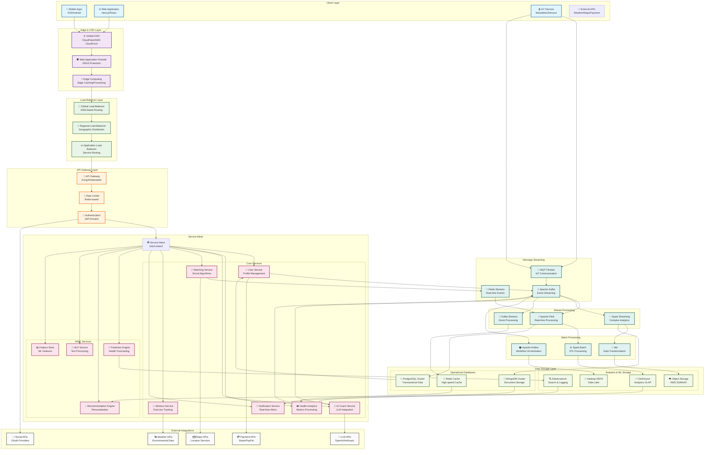
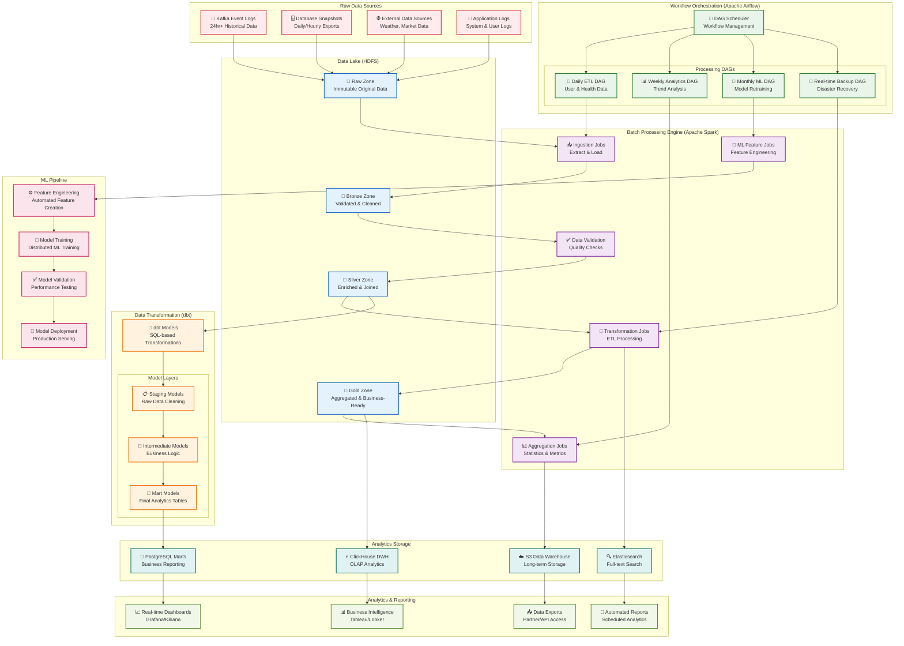
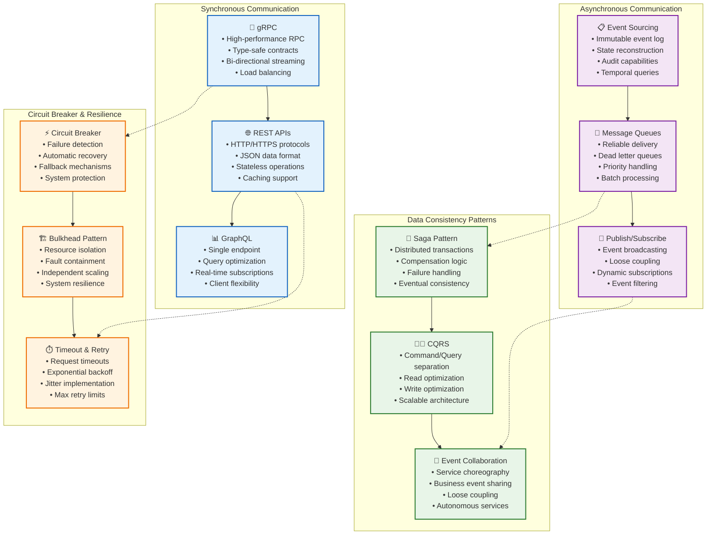

# NEXUS-TWIN: Distributed Enterprise Architecture

**Comprehensive Distributed System Architecture for AI-Powered Fitness Platform**

*Version 2.0 - Production-Ready Scalable Architecture*

---

## 📋 Table of Contents

1. [Executive Architecture Overview](#executive-architecture-overview)
2. [System Architecture Diagrams](#system-architecture-diagrams)
3. [Data Flow Architecture](#data-flow-architecture)
4. [Microservices Ecosystem](#microservices-ecosystem)
5. [Real-Time Streaming Pipeline](#real-time-streaming-pipeline)
6. [Machine Learning Pipeline](#machine-learning-pipeline)
7. [Load Balancing & High Availability](#load-balancing--high-availability)
8. [Data Storage Architecture](#data-storage-architecture)
9. [Security & Compliance](#security--compliance)
10. [Deployment Architecture](#deployment-architecture)
11. [Monitoring & Observability](#monitoring--observability)
12. [Scalability Metrics & Performance](#scalability-metrics--performance)

---

## 🎯 Executive Architecture Overview

### Transformation Strategy
**NEXUS-TWIN** evolves from a successful hackathon prototype into a production-grade, globally distributed AI-powered fitness platform capable of serving millions of users simultaneously with real-time intelligence and social interactions.

### Key Architectural Goals
- **🚀 Scale**: Handle 10M+ concurrent users globally
- **⚡ Performance**: Sub-100ms response times for critical operations
- **🧠 Intelligence**: Real-time adaptive AI and machine learning
- **🔧 Reliability**: 99.99% uptime with fault tolerance
- **🌍 Global**: Multi-region deployment with edge computing

---

## 🏗️ System Architecture Diagrams

### 1. High-Level System Architecture



---

## 📊 Data Flow Architecture

### 1. Real-Time Data Pipeline

```mermaid
flowchart TD
    subgraph "Data Sources"
        MOBILE_APP[📱 Mobile App<br/>Health Data Input]
        WEARABLES[⌚ Wearables<br/>IoT Sensors]
        WEB_APP[🌐 Web Platform<br/>User Interactions]
        EXTERNAL_API[🔗 External APIs<br/>Weather/Location]
    end
    
    subgraph "Data Ingestion"
        API_GATEWAY[🚪 API Gateway<br/>REST/GraphQL]
        WEBSOCKET[🔌 WebSocket<br/>Real-time Connection]
        MQTT_BROKER[📡 MQTT Broker<br/>IoT Protocol]
        WEBHOOK[🪝 Webhooks<br/>External Events]
    end
    
    subgraph "Event Streaming Backbone"
        KAFKA_CLUSTER[📨 Kafka Cluster<br/>Distributed Streaming]
        
        subgraph "Topic Partitions"
            USER_EVENTS[👤 user-events<br/>Partition: user_id]
            HEALTH_METRICS[❤️ health-metrics<br/>Partition: sensor_type]
            WORKOUT_DATA[💪 workout-data<br/>Partition: activity_type]
            SOCIAL_EVENTS[🤝 social-events<br/>Partition: interaction_type]
            AI_INTERACTIONS[🤖 ai-interactions<br/>Partition: conversation_id]
        end
    end
    
    subgraph "Stream Processing Layer"
        REAL_TIME_PROCESSOR[⚡ Real-time Processor<br/>Apache Flink]
        
        subgraph "Processing Jobs"
            HEALTH_ANALYZER[❤️ Health Analysis<br/>Anomaly Detection]
            ACTIVITY_TRACKER[📊 Activity Tracking<br/>Progress Calculation]
            SOCIAL_MATCHER[🤝 Social Matching<br/>Real-time Scoring]
            AI_CONTEXT[🧠 AI Context Builder<br/>Conversation State]
            ALERT_GENERATOR[🚨 Alert Generator<br/>Threshold Monitoring]
        end
    end
    
    subgraph "Feature Engineering"
        FEATURE_PROCESSOR[⚙️ Feature Processor<br/>Real-time Features]
        
        subgraph "Feature Categories"
            USER_FEATURES[👤 User Features<br/>Demographics, Preferences]
            HEALTH_FEATURES[❤️ Health Features<br/>Vitals, Trends, Patterns]
            BEHAVIORAL_FEATURES[📈 Behavioral Features<br/>Usage Patterns, Engagement]
            CONTEXTUAL_FEATURES[🌍 Contextual Features<br/>Time, Location, Weather]
            SOCIAL_FEATURES[🤝 Social Features<br/>Connections, Interactions]
        end
    end
    
    subgraph "ML Inference Pipeline"
        MODEL_SERVING[🔮 Model Serving<br/>TensorFlow Serving]
        
        subgraph "ML Models"
            HEALTH_PREDICTOR[❤️ Health Predictor<br/>Energy, Recovery, Readiness]
            RECOMMENDATION_ENGINE[💡 Recommendation Engine<br/>Workouts, Nutrition, Activities]
            MATCHING_ALGORITHM[🤝 Matching Algorithm<br/>Social Compatibility]
            ANOMALY_DETECTOR[🚨 Anomaly Detector<br/>Health Alerts]
            PERSONALIZATION[🎯 Personalization Engine<br/>Content Customization]
        end
    end
    
    subgraph "Real-time Storage"
        FEATURE_STORE[📊 Feature Store<br/>Redis + PostgreSQL]
        PREDICTION_CACHE[🔮 Prediction Cache<br/>Redis Cluster]
        SESSION_STORE[🔐 Session Store<br/>Redis Sessions]
        REAL_TIME_ANALYTICS[📈 Real-time Analytics<br/>ClickHouse]
    end
    
    subgraph "Action Triggers"
        NOTIFICATION_SERVICE[🔔 Notification Service<br/>Push/SMS/Email]
        RECOMMENDATION_SERVICE[💡 Recommendation Service<br/>Personalized Suggestions]
        ALERT_SERVICE[🚨 Alert Service<br/>Health/Safety Alerts]
        SOCIAL_SERVICE[🤝 Social Service<br/>Matching Notifications]
    end
    
    subgraph "Client Delivery"
        WEBSOCKET_DELIVERY[🔌 WebSocket<br/>Real-time Updates]
        PUSH_NOTIFICATIONS[📱 Push Notifications<br/>Mobile/Web]
        IN_APP_MESSAGES[💬 In-App Messages<br/>Contextual Alerts]
        API_RESPONSES[📤 API Responses<br/>Synchronous Replies]
    end

    %% Data ingestion flow
    MOBILE_APP --> API_GATEWAY
    MOBILE_APP --> WEBSOCKET
    WEARABLES --> MQTT_BROKER
    WEB_APP --> API_GATEWAY
    WEB_APP --> WEBSOCKET
    EXTERNAL_API --> WEBHOOK

    %% Stream ingestion
    API_GATEWAY --> KAFKA_CLUSTER
    WEBSOCKET --> KAFKA_CLUSTER
    MQTT_BROKER --> KAFKA_CLUSTER
    WEBHOOK --> KAFKA_CLUSTER

    %% Topic routing
    KAFKA_CLUSTER --> USER_EVENTS
    KAFKA_CLUSTER --> HEALTH_METRICS
    KAFKA_CLUSTER --> WORKOUT_DATA
    KAFKA_CLUSTER --> SOCIAL_EVENTS
    KAFKA_CLUSTER --> AI_INTERACTIONS

    %% Stream processing
    USER_EVENTS --> REAL_TIME_PROCESSOR
    HEALTH_METRICS --> REAL_TIME_PROCESSOR
    WORKOUT_DATA --> REAL_TIME_PROCESSOR
    SOCIAL_EVENTS --> REAL_TIME_PROCESSOR
    AI_INTERACTIONS --> REAL_TIME_PROCESSOR

    %% Processing jobs
    REAL_TIME_PROCESSOR --> HEALTH_ANALYZER
    REAL_TIME_PROCESSOR --> ACTIVITY_TRACKER
    REAL_TIME_PROCESSOR --> SOCIAL_MATCHER
    REAL_TIME_PROCESSOR --> AI_CONTEXT
    REAL_TIME_PROCESSOR --> ALERT_GENERATOR

    %% Feature engineering
    HEALTH_ANALYZER --> FEATURE_PROCESSOR
    ACTIVITY_TRACKER --> FEATURE_PROCESSOR
    SOCIAL_MATCHER --> FEATURE_PROCESSOR

    FEATURE_PROCESSOR --> USER_FEATURES
    FEATURE_PROCESSOR --> HEALTH_FEATURES
    FEATURE_PROCESSOR --> BEHAVIORAL_FEATURES
    FEATURE_PROCESSOR --> CONTEXTUAL_FEATURES
    FEATURE_PROCESSOR --> SOCIAL_FEATURES

    %% ML inference
    USER_FEATURES --> MODEL_SERVING
    HEALTH_FEATURES --> MODEL_SERVING
    BEHAVIORAL_FEATURES --> MODEL_SERVING
    CONTEXTUAL_FEATURES --> MODEL_SERVING
    SOCIAL_FEATURES --> MODEL_SERVING

    MODEL_SERVING --> HEALTH_PREDICTOR
    MODEL_SERVING --> RECOMMENDATION_ENGINE
    MODEL_SERVING --> MATCHING_ALGORITHM
    MODEL_SERVING --> ANOMALY_DETECTOR
    MODEL_SERVING --> PERSONALIZATION

    %% Storage
    USER_FEATURES --> FEATURE_STORE
    HEALTH_PREDICTOR --> PREDICTION_CACHE
    AI_CONTEXT --> SESSION_STORE
    ALERT_GENERATOR --> REAL_TIME_ANALYTICS

    %% Action triggers
    HEALTH_PREDICTOR --> NOTIFICATION_SERVICE
    RECOMMENDATION_ENGINE --> RECOMMENDATION_SERVICE
    ANOMALY_DETECTOR --> ALERT_SERVICE
    MATCHING_ALGORITHM --> SOCIAL_SERVICE

    %% Client delivery
    NOTIFICATION_SERVICE --> WEBSOCKET_DELIVERY
    NOTIFICATION_SERVICE --> PUSH_NOTIFICATIONS
    RECOMMENDATION_SERVICE --> IN_APP_MESSAGES
    ALERT_SERVICE --> API_RESPONSES
    SOCIAL_SERVICE --> WEBSOCKET_DELIVERY

    %% Styling
    classDef dataSource fill:#e3f2fd,stroke:#1565c0,stroke-width:2px
    classDef ingestion fill:#f3e5f5,stroke:#7b1fa2,stroke-width:2px
    classDef streaming fill:#e8f5e8,stroke:#2e7d32,stroke-width:2px
    classDef processing fill:#fff3e0,stroke:#ef6c00,stroke-width:2px
    classDef features fill:#fce4ec,stroke:#c2185b,stroke-width:2px
    classDef ml fill:#e0f2f1,stroke:#00695c,stroke-width:2px
    classDef storage fill:#f1f8e9,stroke:#558b2f,stroke-width:2px
    classDef actions fill:#fafafa,stroke:#424242,stroke-width:2px
    classDef delivery fill:#e8eaf6,stroke:#3949ab,stroke-width:2px

    class MOBILE_APP,WEARABLES,WEB_APP,EXTERNAL_API dataSource
    class API_GATEWAY,WEBSOCKET,MQTT_BROKER,WEBHOOK ingestion
    class KAFKA_CLUSTER,USER_EVENTS,HEALTH_METRICS,WORKOUT_DATA,SOCIAL_EVENTS,AI_INTERACTIONS streaming
    class REAL_TIME_PROCESSOR,HEALTH_ANALYZER,ACTIVITY_TRACKER,SOCIAL_MATCHER,AI_CONTEXT,ALERT_GENERATOR processing
    class FEATURE_PROCESSOR,USER_FEATURES,HEALTH_FEATURES,BEHAVIORAL_FEATURES,CONTEXTUAL_FEATURES,SOCIAL_FEATURES features
    class MODEL_SERVING,HEALTH_PREDICTOR,RECOMMENDATION_ENGINE,MATCHING_ALGORITHM,ANOMALY_DETECTOR,PERSONALIZATION ml
    class FEATURE_STORE,PREDICTION_CACHE,SESSION_STORE,REAL_TIME_ANALYTICS storage
    class NOTIFICATION_SERVICE,RECOMMENDATION_SERVICE,ALERT_SERVICE,SOCIAL_SERVICE actions
    class WEBSOCKET_DELIVERY,PUSH_NOTIFICATIONS,IN_APP_MESSAGES,API_RESPONSES delivery
```



### 2. Batch Data Processing Pipeline



---

## 🔧 Microservices Ecosystem

### 1. Service Domain Architecture

```mermaid
graph TB
    subgraph "API Gateway Layer"
        KONG[🚪 Kong API Gateway<br/>• Request routing<br/>• Rate limiting<br/>• Authentication<br/>• API versioning]
        AMBASSADOR[🎭 Ambassador<br/>• Load balancing<br/>• Circuit breaker<br/>• Request transformation<br/>• Metrics collection]
    end

    subgraph "Authentication & Security Domain"
        AUTH_SERVICE[🔐 Authentication Service<br/>• JWT token management<br/>• OAuth2/OIDC integration<br/>• Multi-factor authentication<br/>• Session management]
        
        AUTHORIZATION[🛡️ Authorization Service<br/>• RBAC implementation<br/>• Permission management<br/>• Policy enforcement<br/>• Audit logging]
        
        SECURITY[🔒 Security Service<br/>• Data encryption<br/>• Privacy compliance<br/>• Threat detection<br/>• Security monitoring]
    end

    subgraph "User Management Domain"
        USER_PROFILE[👤 User Profile Service<br/>• Profile management<br/>• Preference settings<br/>• Account lifecycle<br/>• Data synchronization]
        
        USER_PREFERENCES[⚙️ User Preferences Service<br/>• Notification settings<br/>• Privacy controls<br/>• Customization options<br/>• Feature toggles]
        
        USER_ANALYTICS[📊 User Analytics Service<br/>• Behavior tracking<br/>• Usage patterns<br/>• Engagement metrics<br/>• Segmentation]
    end

    subgraph "Health & Fitness Domain"
        HEALTH_METRICS[❤️ Health Metrics Service<br/>• Vital signs processing<br/>• Health data validation<br/>• Trend analysis<br/>• Alert generation]
        
        WORKOUT_TRACKING[💪 Workout Tracking Service<br/>• Exercise logging<br/>• Performance metrics<br/>• Progress tracking<br/>• Goal management]
        
        NUTRITION[🥗 Nutrition Service<br/>• Meal tracking<br/>• Calorie calculation<br/>• Macro analysis<br/>• Diet recommendations]
        
        SLEEP_ANALYSIS[😴 Sleep Analysis Service<br/>• Sleep pattern tracking<br/>• Quality assessment<br/>• Recovery analysis<br/>• Sleep optimization]
    end

    subgraph "AI & Intelligence Domain"
        AI_COACH[🤖 AI Coach Service<br/>• Conversational AI<br/>• Personalized coaching<br/>• Goal setting<br/>• Progress guidance]
        
        PREDICTION_ENGINE[🔮 Prediction Engine<br/>• Health forecasting<br/>• Performance prediction<br/>• Risk assessment<br/>• Trend projection]
        
        RECOMMENDATION[💡 Recommendation Service<br/>• Workout suggestions<br/>• Nutrition advice<br/>• Activity recommendations<br/>• Content personalization]
        
        NLP_SERVICE[📝 NLP Service<br/>• Text analysis<br/>• Sentiment detection<br/>• Intent recognition<br/>• Language processing]
    end

    subgraph "Social & Matching Domain"
        SOCIAL_GRAPH[🤝 Social Graph Service<br/>• Connection management<br/>• Relationship tracking<br/>• Network analysis<br/>• Social scoring]
        
        MATCHING_ENGINE[🎯 Matching Engine<br/>• Compatibility algorithms<br/>• Partner matching<br/>• Group formation<br/>• Activity pairing]
        
        MESSAGING[💬 Messaging Service<br/>• Real-time chat<br/>• Group messaging<br/>• Media sharing<br/>• Message history]
        
        ACTIVITY_FEED[📱 Activity Feed Service<br/>• Social timeline<br/>• Activity sharing<br/>• Engagement tracking<br/>• Content moderation]
    end

    subgraph "Location & Context Domain"
        LOCATION[🗺️ Location Service<br/>• Geolocation processing<br/>• Place recognition<br/>• Route tracking<br/>• Proximity detection]
        
        WEATHER[🌤️ Weather Service<br/>• Weather data integration<br/>• Environmental context<br/>• Activity recommendations<br/>• Safety alerts]
        
        CONTEXT_ENGINE[🌍 Context Engine<br/>• Situational awareness<br/>• Environmental factors<br/>• Time-based context<br/>• Behavioral patterns]
    end

    subgraph "Notification & Communication Domain"
        NOTIFICATION[🔔 Notification Service<br/>• Push notifications<br/>• Email campaigns<br/>• SMS alerts<br/>• In-app messaging]
        
        COMMUNICATION[📞 Communication Service<br/>• Video calls<br/>• Voice messages<br/>• Screen sharing<br/>• Real-time collaboration]
        
        REMINDER[⏰ Reminder Service<br/>• Scheduled reminders<br/>• Goal notifications<br/>• Habit tracking<br/>• Motivational messages]
    end

    subgraph "Content & Media Domain"
        MEDIA_MANAGEMENT[📸 Media Management Service<br/>• Image/video processing<br/>• Storage optimization<br/>• CDN integration<br/>• Content validation]
        
        CONTENT_DELIVERY[🎬 Content Delivery Service<br/>• Exercise videos<br/>• Educational content<br/>• Progress visualizations<br/>• Interactive media]
        
        SEARCH[🔍 Search Service<br/>• Full-text search<br/>• Semantic search<br/>• Faceted search<br/>• Search analytics]
    end

    %% Gateway connections
    KONG --> AUTH_SERVICE
    AMBASSADOR --> USER_PROFILE
    
    %% Authentication domain connections
    AUTH_SERVICE --> AUTHORIZATION
    AUTHORIZATION --> SECURITY
    
    %% User domain connections
    USER_PROFILE --> USER_PREFERENCES
    USER_PROFILE --> USER_ANALYTICS
    
    %% Health domain connections
    HEALTH_METRICS --> WORKOUT_TRACKING
    WORKOUT_TRACKING --> NUTRITION
    NUTRITION --> SLEEP_ANALYSIS
    
    %% AI domain connections
    AI_COACH --> PREDICTION_ENGINE
    PREDICTION_ENGINE --> RECOMMENDATION
    RECOMMENDATION --> NLP_SERVICE
    
    %% Social domain connections
    SOCIAL_GRAPH --> MATCHING_ENGINE
    MATCHING_ENGINE --> MESSAGING
    MESSAGING --> ACTIVITY_FEED
    
    %% Location domain connections
    LOCATION --> WEATHER
    WEATHER --> CONTEXT_ENGINE
    
    %% Notification domain connections
    NOTIFICATION --> COMMUNICATION
    COMMUNICATION --> REMINDER
    
    %% Content domain connections
    MEDIA_MANAGEMENT --> CONTENT_DELIVERY
    CONTENT_DELIVERY --> SEARCH

    %% Cross-domain integrations
    USER_PROFILE -.-> HEALTH_METRICS
    HEALTH_METRICS -.-> PREDICTION_ENGINE
    PREDICTION_ENGINE -.-> AI_COACH
    MATCHING_ENGINE -.-> SOCIAL_GRAPH
    LOCATION -.-> CONTEXT_ENGINE
    CONTEXT_ENGINE -.-> RECOMMENDATION
    NOTIFICATION -.-> USER_PREFERENCES

    %% Styling
    classDef gateway fill:#e1f5fe,stroke:#01579b,stroke-width:3px
    classDef auth fill:#f3e5f5,stroke:#4a148c,stroke-width:2px
    classDef user fill:#e8f5e8,stroke:#1b5e20,stroke-width:2px
    classDef health fill:#fff3e0,stroke:#e65100,stroke-width:2px
    classDef ai fill:#fce4ec,stroke:#880e4f,stroke-width:2px
    classDef social fill:#e0f2f1,stroke:#004d40,stroke-width:2px
    classDef location fill:#f1f8e9,stroke:#33691e,stroke-width:2px
    classDef notification fill:#fafafa,stroke:#424242,stroke-width:2px
    classDef content fill:#e8eaf6,stroke:#3949ab,stroke-width:2px

    class KONG,AMBASSADOR gateway
    class AUTH_SERVICE,AUTHORIZATION,SECURITY auth
    class USER_PROFILE,USER_PREFERENCES,USER_ANALYTICS user
    class HEALTH_METRICS,WORKOUT_TRACKING,NUTRITION,SLEEP_ANALYSIS health
    class AI_COACH,PREDICTION_ENGINE,RECOMMENDATION,NLP_SERVICE ai
    class SOCIAL_GRAPH,MATCHING_ENGINE,MESSAGING,ACTIVITY_FEED social
    class LOCATION,WEATHER,CONTEXT_ENGINE location
    class NOTIFICATION,COMMUNICATION,REMINDER notification
    class MEDIA_MANAGEMENT,CONTENT_DELIVERY,SEARCH content
```



### 2. Service Communication Patterns



---

## ⚡ Real-Time Streaming Pipeline

### 1. Apache Kafka Event Streaming Architecture

```mermaid
graph TB
    subgraph "Event Producers"
        MOBILE_PRODUCER[📱 Mobile App Producer<br/>• User interactions<br/>• Health data<br/>• Location updates<br/>• Performance metrics]
        
        WEB_PRODUCER[🌐 Web App Producer<br/>• Click streams<br/>• Session data<br/>• Form submissions<br/>• Page analytics]
        
        IOT_PRODUCER[⌚ IoT Device Producer<br/>• Sensor data<br/>• Vital signs<br/>• Environmental data<br/>• Device status]
        
        SERVICE_PRODUCER[🔧 Service Producer<br/>• System events<br/>• API calls<br/>• Database changes<br/>• Error logs]
    end

    subgraph "Kafka Cluster"
        BROKER_1[📨 Kafka Broker 1<br/>• Leader for partitions 0,3,6<br/>• Follower for partitions 1,2,4,5,7,8<br/>• Replication factor: 3]
        
        BROKER_2[📨 Kafka Broker 2<br/>• Leader for partitions 1,4,7<br/>• Follower for partitions 0,2,3,5,6,8<br/>• Replication factor: 3]
        
        BROKER_3[📨 Kafka Broker 3<br/>• Leader for partitions 2,5,8<br/>• Follower for partitions 0,1,3,4,6,7<br/>• Replication factor: 3]
        
        ZOOKEEPER[🗃️ Zookeeper Ensemble<br/>• Cluster coordination<br/>• Metadata management<br/>• Leader election<br/>• Configuration storage]
    end

    subgraph "Topic Architecture"
        USER_EVENTS_TOPIC[👤 user-events Topic<br/>• Partitions: 12<br/>• Replication: 3<br/>• Retention: 7 days<br/>• Key: user_id]
        
        HEALTH_METRICS_TOPIC[❤️ health-metrics Topic<br/>• Partitions: 24<br/>• Replication: 3<br/>• Retention: 30 days<br/>• Key: device_id + metric_type]
        
        WORKOUT_DATA_TOPIC[💪 workout-data Topic<br/>• Partitions: 8<br/>• Replication: 3<br/>• Retention: 90 days<br/>• Key: workout_session_id]
        
        SOCIAL_EVENTS_TOPIC[🤝 social-events Topic<br/>• Partitions: 6<br/>• Replication: 3<br/>• Retention: 14 days<br/>• Key: interaction_type]
        
        AI_INTERACTIONS_TOPIC[🤖 ai-interactions Topic<br/>• Partitions: 16<br/>• Replication: 3<br/>• Retention: 60 days<br/>• Key: conversation_id]
    end

    subgraph "Stream Processing (Apache Flink)"
        FLINK_CLUSTER[⚡ Flink Cluster<br/>• JobManager (HA)<br/>• TaskManagers (8 nodes)<br/>• Checkpointing enabled<br/>• Exactly-once processing]
        
        subgraph "Flink Jobs"
            HEALTH_PROCESSOR[❤️ Health Stream Processor<br/>• Anomaly detection<br/>• Trend analysis<br/>• Alert generation<br/>• Real-time scoring]
            
            ACTIVITY_PROCESSOR[📊 Activity Stream Processor<br/>• Progress calculation<br/>• Goal tracking<br/>• Performance metrics<br/>• Achievement detection]
            
            SOCIAL_PROCESSOR[🤝 Social Stream Processor<br/>• Matching algorithm<br/>• Interaction analysis<br/>• Network effects<br/>• Engagement scoring]
            
            AI_CONTEXT_PROCESSOR[🧠 AI Context Processor<br/>• Conversation state<br/>• Context building<br/>• Intent recognition<br/>• Response optimization]
        end
    end

    subgraph "Event Consumers"
        REAL_TIME_ANALYTICS[📈 Real-time Analytics<br/>• Live dashboards<br/>• Instant metrics<br/>• Performance monitoring<br/>• Business KPIs]
        
        NOTIFICATION_ENGINE[🔔 Notification Engine<br/>• Push notifications<br/>• Alert processing<br/>• Message routing<br/>• Delivery tracking]
        
        ML_FEATURE_STORE[🤖 ML Feature Store<br/>• Feature computation<br/>• Real-time features<br/>• Model serving<br/>• Prediction cache]
        
        DATABASE_SYNC[🗄️ Database Sync<br/>• Change data capture<br/>• Data synchronization<br/>• Consistency maintenance<br/>• Backup processes]
    end

    subgraph "Monitoring & Management"
        KAFKA_MANAGER[📊 Kafka Manager<br/>• Cluster monitoring<br/>• Topic management<br/>• Consumer lag tracking<br/>• Performance metrics]
        
        SCHEMA_REGISTRY[📋 Schema Registry<br/>• Avro schemas<br/>• Schema evolution<br/>• Compatibility checks<br/>• Version management]
        
        KAFKA_CONNECT[🔗 Kafka Connect<br/>• Source connectors<br/>• Sink connectors<br/>• Data pipeline<br/>• Error handling]
    end

    %% Producer connections
    MOBILE_PRODUCER --> BROKER_1
    WEB_PRODUCER --> BROKER_2
    IOT_PRODUCER --> BROKER_3
    SERVICE_PRODUCER --> BROKER_1

    %% Broker coordination
    BROKER_1 -.-> ZOOKEEPER
    BROKER_2 -.-> ZOOKEEPER
    BROKER_3 -.-> ZOOKEEPER

    %% Topic distribution
    BROKER_1 --> USER_EVENTS_TOPIC
    BROKER_1 --> HEALTH_METRICS_TOPIC
    BROKER_2 --> WORKOUT_DATA_TOPIC
    BROKER_2 --> SOCIAL_EVENTS_TOPIC
    BROKER_3 --> AI_INTERACTIONS_TOPIC

    %% Stream processing
    USER_EVENTS_TOPIC --> FLINK_CLUSTER
    HEALTH_METRICS_TOPIC --> FLINK_CLUSTER
    WORKOUT_DATA_TOPIC --> FLINK_CLUSTER
    SOCIAL_EVENTS_TOPIC --> FLINK_CLUSTER
    AI_INTERACTIONS_TOPIC --> FLINK_CLUSTER

    FLINK_CLUSTER --> HEALTH_PROCESSOR
    FLINK_CLUSTER --> ACTIVITY_PROCESSOR
    FLINK_CLUSTER --> SOCIAL_PROCESSOR
    FLINK_CLUSTER --> AI_CONTEXT_PROCESSOR

    %% Consumer connections
    HEALTH_PROCESSOR --> REAL_TIME_ANALYTICS
    ACTIVITY_PROCESSOR --> NOTIFICATION_ENGINE
    SOCIAL_PROCESSOR --> ML_FEATURE_STORE
    AI_CONTEXT_PROCESSOR --> DATABASE_SYNC

    %% Management connections
    BROKER_1 -.-> KAFKA_MANAGER
    BROKER_2 -.-> SCHEMA_REGISTRY
    BROKER_3 -.-> KAFKA_CONNECT

    classDef producer fill:#e3f2fd,stroke:#1565c0,stroke-width:2px
    classDef broker fill:#f3e5f5,stroke:#7b1fa2,stroke-width:2px
    classDef topic fill:#e8f5e8,stroke:#2e7d32,stroke-width:2px
    classDef processing fill:#fff3e0,stroke:#ef6c00,stroke-width:2px
    classDef consumer fill:#fce4ec,stroke:#c2185b,stroke-width:2px
    classDef management fill:#e0f2f1,stroke:#00695c,stroke-width:2px

    class MOBILE_PRODUCER,WEB_PRODUCER,IOT_PRODUCER,SERVICE_PRODUCER producer
    class BROKER_1,BROKER_2,BROKER_3,ZOOKEEPER broker
    class USER_EVENTS_TOPIC,HEALTH_METRICS_TOPIC,WORKOUT_DATA_TOPIC,SOCIAL_EVENTS_TOPIC,AI_INTERACTIONS_TOPIC topic
    class FLINK_CLUSTER,HEALTH_PROCESSOR,ACTIVITY_PROCESSOR,SOCIAL_PROCESSOR,AI_CONTEXT_PROCESSOR processing
    class REAL_TIME_ANALYTICS,NOTIFICATION_ENGINE,ML_FEATURE_STORE,DATABASE_SYNC consumer
    class KAFKA_MANAGER,SCHEMA_REGISTRY,KAFKA_CONNECT management
```

### 2. Real-Time Processing Windows & Aggregations

```mermaid
graph TB
    subgraph "Time-Based Windows"
        TUMBLING[🕐 Tumbling Windows<br/>• Fixed size: 1min, 5min, 1hour<br/>• Non-overlapping<br/>• Aggregate metrics<br/>• Batch-like processing]
        
        SLIDING[🕑 Sliding Windows<br/>• Size: 10min, Slide: 1min<br/>• Overlapping windows<br/>• Trend detection<br/>• Smooth aggregations]
        
        SESSION[🕒 Session Windows<br/>• Gap-based (30min timeout)<br/>• User activity sessions<br/>• Dynamic duration<br/>• Behavior analysis]
    end

    subgraph "Event-Time Processing"
        WATERMARKS[💧 Watermarks<br/>• Late data handling<br/>• Out-of-order events<br/>• Processing time bounds<br/>• Data completeness]
        
        LATE_DATA[⏰ Late Data Handling<br/>• Allowed lateness: 1 hour<br/>• Side output streams<br/>• Recovery mechanisms<br/>• Data quality metrics]
    end

    subgraph "Stateful Operations"
        KEYED_STATE[🗝️ Keyed State<br/>• Per-user state<br/>• Health profiles<br/>• Activity history<br/>• Personalization data]
        
        OPERATOR_STATE[⚙️ Operator State<br/>• Processing state<br/>• Buffering data<br/>• Checkpointing<br/>• Recovery state]
    end

    subgraph "Real-Time Aggregations"
        HEALTH_AGG[❤️ Health Aggregations<br/>• Average heart rate (5min)<br/>• Steps per hour<br/>• Calories burned daily<br/>• Sleep quality trends]
        
        ACTIVITY_AGG[💪 Activity Aggregations<br/>• Workout intensity (session)<br/>• Progress metrics (weekly)<br/>• Goal achievement (monthly)<br/>• Performance trends]
        
        SOCIAL_AGG[🤝 Social Aggregations<br/>• Interaction frequency<br/>• Engagement rates<br/>• Network growth<br/>• Community metrics]
    end

    %% Window processing flows
    TUMBLING --> HEALTH_AGG
    SLIDING --> ACTIVITY_AGG
    SESSION --> SOCIAL_AGG

    %% Event-time handling
    WATERMARKS --> TUMBLING
    WATERMARKS --> SLIDING
    LATE_DATA --> SESSION

    %% State management
    KEYED_STATE --> HEALTH_AGG
    OPERATOR_STATE --> ACTIVITY_AGG
    KEYED_STATE --> SOCIAL_AGG

    classDef windows fill:#e3f2fd,stroke:#1565c0,stroke-width:2px
    classDef eventTime fill:#f3e5f5,stroke:#7b1fa2,stroke-width:2px
    classDef state fill:#e8f5e8,stroke:#2e7d32,stroke-width:2px
    classDef aggregation fill:#fff3e0,stroke:#ef6c00,stroke-width:2px

    class TUMBLING,SLIDING,SESSION windows
    class WATERMARKS,LATE_DATA eventTime
    class KEYED_STATE,OPERATOR_STATE state
    class HEALTH_AGG,ACTIVITY_AGG,SOCIAL_AGG aggregation
```

---

## 🤖 Machine Learning Pipeline

### 1. MLOps Architecture

```mermaid
graph TB
    subgraph "Data Pipeline"
        RAW_DATA[📊 Raw Data Sources<br/>• User interactions<br/>• Health sensors<br/>• External APIs<br/>• System logs]
        
        DATA_VALIDATION[✅ Data Validation<br/>• Schema validation<br/>• Data quality checks<br/>• Anomaly detection<br/>• Drift monitoring]
        
        FEATURE_ENGINEERING[⚙️ Feature Engineering<br/>• Feature extraction<br/>• Transformations<br/>• Scaling & normalization<br/>• Feature selection]
        
        FEATURE_STORE[📦 Feature Store<br/>• Centralized features<br/>• Version control<br/>• Serving layer<br/>• Feature discovery]
    end

    subgraph "Model Development"
        EXPERIMENTATION[🧪 Experimentation<br/>• Jupyter notebooks<br/>• MLflow tracking<br/>• Hyperparameter tuning<br/>• Model comparison]
        
        MODEL_TRAINING[🎯 Model Training<br/>• Distributed training<br/>• Hyperparameter optimization<br/>• Cross-validation<br/>• Model versioning]
        
        MODEL_VALIDATION[✅ Model Validation<br/>• Performance metrics<br/>• A/B testing<br/>• Bias detection<br/>• Fairness evaluation]
        
        MODEL_REGISTRY[📚 Model Registry<br/>• Version management<br/>• Model metadata<br/>• Approval workflow<br/>• Lineage tracking]
    end

    subgraph "Model Deployment"
        STAGING_ENV[🧪 Staging Environment<br/>• Pre-production testing<br/>• Integration testing<br/>• Performance testing<br/>• Smoke tests]
        
        CANARY_DEPLOYMENT[🐤 Canary Deployment<br/>• Gradual rollout<br/>• Traffic splitting<br/>• Risk mitigation<br/>• Rollback capability]
        
        PRODUCTION_SERVING[🚀 Production Serving<br/>• Model endpoints<br/>• Load balancing<br/>• Auto-scaling<br/>• High availability]
        
        SHADOW_MODE[👥 Shadow Mode<br/>• Parallel execution<br/>• Performance comparison<br/>• Risk-free validation<br/>• Data collection]
    end

    subgraph "Model Monitoring"
        PERFORMANCE_MONITORING[📊 Performance Monitoring<br/>• Prediction accuracy<br/>• Response latency<br/>• Throughput metrics<br/>• Error rates]
        
        DATA_DRIFT_DETECTION[🔍 Data Drift Detection<br/>• Feature drift<br/>• Concept drift<br/>• Population drift<br/>• Alert system]
        
        MODEL_EXPLAINABILITY[💡 Model Explainability<br/>• Feature importance<br/>• SHAP values<br/>• Model interpretation<br/>• Decision reasoning]
        
        FEEDBACK_LOOP[🔄 Feedback Loop<br/>• User feedback<br/>• Model improvement<br/>• Continuous learning<br/>• Retraining triggers]
    end

    %% Data pipeline flow
    RAW_DATA --> DATA_VALIDATION
    DATA_VALIDATION --> FEATURE_ENGINEERING
    FEATURE_ENGINEERING --> FEATURE_STORE

    %% Model development flow
    FEATURE_STORE --> EXPERIMENTATION
    EXPERIMENTATION --> MODEL_TRAINING
    MODEL_TRAINING --> MODEL_VALIDATION
    MODEL_VALIDATION --> MODEL_REGISTRY

    %% Deployment flow
    MODEL_REGISTRY --> STAGING_ENV
    STAGING_ENV --> CANARY_DEPLOYMENT
    CANARY_DEPLOYMENT --> PRODUCTION_SERVING
    PRODUCTION_SERVING --> SHADOW_MODE

    %% Monitoring connections
    PRODUCTION_SERVING --> PERFORMANCE_MONITORING
    PRODUCTION_SERVING --> DATA_DRIFT_DETECTION
    SHADOW_MODE --> MODEL_EXPLAINABILITY
    MODEL_EXPLAINABILITY --> FEEDBACK_LOOP

    %% Feedback to development
    FEEDBACK_LOOP -.-> EXPERIMENTATION
    DATA_DRIFT_DETECTION -.-> MODEL_TRAINING
    PERFORMANCE_MONITORING -.-> MODEL_VALIDATION

    classDef dataPipeline fill:#e3f2fd,stroke:#1565c0,stroke-width:2px
    classDef development fill:#f3e5f5,stroke:#7b1fa2,stroke-width:2px
    classDef deployment fill:#e8f5e8,stroke:#2e7d32,stroke-width:2px
    classDef monitoring fill:#fff3e0,stroke:#ef6c00,stroke-width:2px

    class RAW_DATA,DATA_VALIDATION,FEATURE_ENGINEERING,FEATURE_STORE dataPipeline
    class EXPERIMENTATION,MODEL_TRAINING,MODEL_VALIDATION,MODEL_REGISTRY development
    class STAGING_ENV,CANARY_DEPLOYMENT,PRODUCTION_SERVING,SHADOW_MODE deployment
    class PERFORMANCE_MONITORING,DATA_DRIFT_DETECTION,MODEL_EXPLAINABILITY,FEEDBACK_LOOP monitoring
```



### 2. Specialized ML Models Architecture

```mermaid
graph TB
    subgraph "Health Prediction Models"
        ENERGY_PREDICTOR[⚡ Energy Level Predictor<br/>• XGBoost ensemble<br/>• Time series features<br/>• Personalized models<br/>• 85% accuracy]
        
        RECOVERY_PREDICTOR[💤 Recovery Index Predictor<br/>• Random Forest<br/>• Sleep & HRV features<br/>• Real-time inference<br/>• 82% accuracy]
        
        READINESS_PREDICTOR[🎯 Readiness Score Predictor<br/>• Neural network<br/>• Multi-modal inputs<br/>• Contextual features<br/>• 88% accuracy]
        
        ANOMALY_DETECTOR[🚨 Health Anomaly Detector<br/>• Isolation Forest<br/>• Statistical methods<br/>• Real-time alerts<br/>• 95% precision]
    end

    subgraph "Recommendation Models"
        WORKOUT_RECOMMENDER[💪 Workout Recommender<br/>• Collaborative filtering<br/>• Content-based filtering<br/>• Hybrid approach<br/>• Personalization]
        
        NUTRITION_RECOMMENDER[🥗 Nutrition Recommender<br/>• Deep learning<br/>• Dietary preferences<br/>• Health constraints<br/>• Goal alignment]
        
        ACTIVITY_RECOMMENDER[🏃 Activity Recommender<br/>• Matrix factorization<br/>• Contextual bandit<br/>• Location-based<br/>• Weather integration]
        
        CONTENT_RECOMMENDER[📱 Content Recommender<br/>• Neural collaborative filtering<br/>• Embedding models<br/>• User behavior<br/>• Engagement optimization]
    end

    subgraph "Social Matching Models"
        COMPATIBILITY_SCORER[🤝 Compatibility Scorer<br/>• Graph neural networks<br/>• Multi-dimensional scoring<br/>• Dynamic weighting<br/>• Real-time updates]
        
        NETWORK_ANALYZER[🕸️ Social Network Analyzer<br/>• Community detection<br/>• Influence modeling<br/>• Relationship strength<br/>• Network effects]
        
        GROUP_FORMATION[👥 Group Formation Model<br/>• Clustering algorithms<br/>• Preference alignment<br/>• Diversity optimization<br/>• Dynamic groups]
        
        INTERACTION_PREDICTOR[💬 Interaction Predictor<br/>• Temporal models<br/>• Behavior patterns<br/>• Engagement likelihood<br/>• Churn prevention]
    end

    subgraph "AI Coach Models"
        CONVERSATION_MODEL[💬 Conversation Model<br/>• Large language models<br/>• Context management<br/>• Personality adaptation<br/>• Multi-turn dialogue]
        
        INTENT_CLASSIFIER[🎯 Intent Classifier<br/>• BERT-based model<br/>• Fine-tuned on fitness<br/>• Multi-class prediction<br/>• 92% accuracy]
        
        RESPONSE_GENERATOR[📝 Response Generator<br/>• GPT-based generation<br/>• Template augmentation<br/>• Tone adaptation<br/>• Safety filtering]
        
        COACHING_OPTIMIZER[🎓 Coaching Optimizer<br/>• Reinforcement learning<br/>• User feedback<br/>• Goal achievement<br/>• Adaptive strategies]
    end

    subgraph "Feature Engineering Pipeline"
        REAL_TIME_FEATURES[⚡ Real-time Features<br/>• Streaming computation<br/>• Low latency<br/>• Kafka Streams<br/>• Redis cache]
        
        BATCH_FEATURES[📊 Batch Features<br/>• Historical aggregations<br/>• Complex calculations<br/>• Spark processing<br/>• Daily updates]
        
        CONTEXTUAL_FEATURES[🌍 Contextual Features<br/>• Time of day<br/>• Weather conditions<br/>• Location context<br/>• Device information]
        
        DERIVED_FEATURES[🔧 Derived Features<br/>• Feature interactions<br/>• Polynomial features<br/>• Statistical measures<br/>• Domain expertise]
    end

    %% Health prediction connections
    REAL_TIME_FEATURES --> ENERGY_PREDICTOR
    BATCH_FEATURES --> RECOVERY_PREDICTOR
    CONTEXTUAL_FEATURES --> READINESS_PREDICTOR
    DERIVED_FEATURES --> ANOMALY_DETECTOR

    %% Recommendation connections
    ENERGY_PREDICTOR --> WORKOUT_RECOMMENDER
    RECOVERY_PREDICTOR --> NUTRITION_RECOMMENDER
    READINESS_PREDICTOR --> ACTIVITY_RECOMMENDER
    ANOMALY_DETECTOR --> CONTENT_RECOMMENDER

    %% Social matching connections
    WORKOUT_RECOMMENDER --> COMPATIBILITY_SCORER
    NUTRITION_RECOMMENDER --> NETWORK_ANALYZER
    ACTIVITY_RECOMMENDER --> GROUP_FORMATION
    CONTENT_RECOMMENDER --> INTERACTION_PREDICTOR

    %% AI coach connections
    COMPATIBILITY_SCORER --> CONVERSATION_MODEL
    NETWORK_ANALYZER --> INTENT_CLASSIFIER
    GROUP_FORMATION --> RESPONSE_GENERATOR
    INTERACTION_PREDICTOR --> COACHING_OPTIMIZER

    %% Feature pipeline connections
    CONVERSATION_MODEL -.-> REAL_TIME_FEATURES
    INTENT_CLASSIFIER -.-> BATCH_FEATURES
    RESPONSE_GENERATOR -.-> CONTEXTUAL_FEATURES
    COACHING_OPTIMIZER -.-> DERIVED_FEATURES

    classDef health fill:#e3f2fd,stroke:#1565c0,stroke-width:2px
    classDef recommendation fill:#f3e5f5,stroke:#7b1fa2,stroke-width:2px
    classDef social fill:#e8f5e8,stroke:#2e7