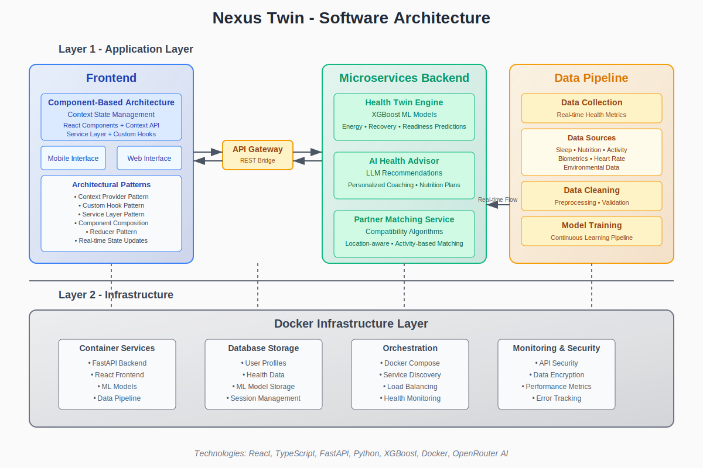

# Nexus Twin: AI-Powered Health & Fitness Digital Twin

## Project Description
Nexus Twin is an innovative health and fitness platform that creates a digital twin of your wellness journey. It uses advanced machine learning models to predict energy levels, recovery, and readiness scores based on your biometric data. The platform combines real-time health metrics analysis with personalized AI coaching and a social matching system for workout partners.

### Key Features
- 🔮 Predictive Health Analytics
- 🤖 AI-Powered Health Coaching
- 🤝 Smart Partner Matching
- 📊 Real-time Health Metrics Dashboard
- 🗺️ Location-based Activity Planning
- 📱 Mobile & Web Interfaces

## Architecture



### Frontend (Next.js + TypeScript)
- Component-based architecture using React
- Context API for state management
- Custom hooks for business logic
- Responsive design for mobile/web
- UI components built with Shadcn UI

### Backend (FastAPI + Python)
- Microservices architecture
- XGBoost ML models for health predictions
- LLM integration for personalized coaching
- RESTful API endpoints
- Location-based services

### Data Pipeline
- Real-time health metrics collection
- Data preprocessing and validation
- Continuous model training pipeline
- Secure data storage

### Infrastructure
- Docker containerization
- Database storage for user profiles and health data
- Performance monitoring

## How to Run

### Prerequisites
- Node.js 18+
- Python 3.9+
- Docker
- npm (for frontend package management)

### Frontend Setup
```bash
cd frontend
npm install
npm run dev
```

### Backend Setup
```bash
cd backend
python -m venv venv
# On Windows
.\venv\Scripts\activate
# On Unix
source venv/bin/activate
pip install -r requirements.txt
python -m uvicorn main:app --host 0.0.0.0 --port 8000
```

### Using Docker
```bash
docker-compose up --build
```

The application will be available at:
- Frontend: http://localhost:3000
- Backend API: http://localhost:8000

## External Sources

### Technologies
- [Next.js](https://nextjs.org/) - React framework
- [FastAPI](https://fastapi.tiangolo.com/) - Backend framework
- [XGBoost](https://xgboost.readthedocs.io/) - Machine learning
- [OpenRouter](https://openrouter.ai/) - AI models
- [Shadcn UI](https://ui.shadcn.com/) - UI components
- [Docker](https://www.docker.com/) - Containerization

### APIs & Services
- [MET Norway Weather API](https://api.met.no/) - Weather data
- [OpenStreetMap Nominatim](https://nominatim.openstreetmap.org/) - Reverse geocoding
- [Overpass API](https://overpass-api.de/) - Location-based fitness venues
- [OpenRouter](https://openrouter.ai/) - LLM services for AI coaching

### Data Sources
- Real-time biometric data
- Weather and environmental data
- Location-based fitness facilities
- User activity and nutrition logs

## Team Members

### Core Contributors
- Balti Mohamed Aziz - Member
- Silini Ahmed - Member
- Ben Ammou Marwen - Member
- Achach Ala Eddine - Member